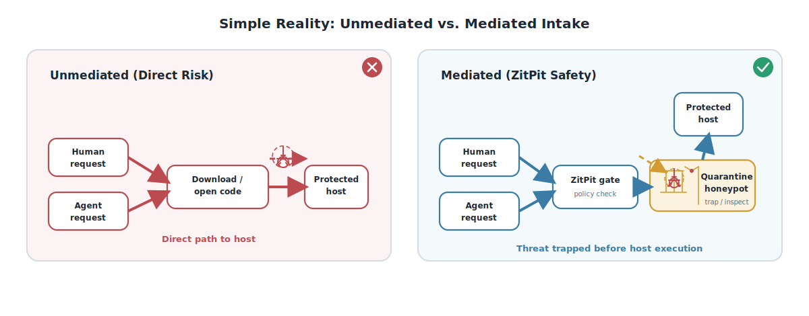

ZitPit is a **consumer-side software admission control layer for agentic development**.

Its core rule is simple: **first-seen external artifacts must earn execution rights under durable policy before they affect a protected host**.

ZitPit still uses the language of an artifact firewall and governed execution plane, but the deeper contract is admission control at the last consumer-side boundary that still matters once agents can search, fetch, open, install, and run faster than humans can review.

The canonical paper source lives in [`paper/main.tex`](paper/main.tex), the latest PDF bundle lives in [`paper/zitpit-v1.0-paper.pdf`](paper/zitpit-v1.0-paper.pdf), and the readable companion draft lives in [`papers/publication-draft.md`](papers/publication-draft.md).

## What Is Proven Today

The current repository proves important parts of the control plane, not universal ecosystem closure.

| Surface | Current public evidence | Status | Supported claim |
| --- | --- | --- | --- |
| Git smart-HTTP intake | Five-repo benchmark harness with web, disk-cache, and hot-cache timings in [`docs/benchmarks/latest.md`](docs/benchmarks/latest.md) | `Implemented` | Approved immutable Git intake can stay faster than unmanaged public fetch |
| Brokered protected-session enforcement families | Docker demo + shell battle packs in [`BENCHMARKS.md`](BENCHMARKS.md) | `Implemented` | Protected sessions can deny selected high-value command families before execution |
| Governed outbound DLP | Demo smoke proofs + egress battle packs in [`BENCHMARKS.md`](BENCHMARKS.md) | `Implemented` | Governed egress can block selected sensitive outbound data before transmission |
| Rust build-time execution | Battle-harness coverage for `build.rs`-style scenarios | `Partial` | Build-time execution can be modeled as a separate capability boundary |
| GitHub Actions immutable-ref enforcement | Threat-model + scenario coverage for mutable refs and unsafe actions | `Partial` | Workflow references should resolve to immutable identities before execution |
| npm / PyPI / raw installer mediation | Benchmark matrix + roadmap targets | `Planned` | Current public docs do not claim package-manager-complete mediation |
| Repo-open enforcement depth | Threat model, policy model, and roadmap targets for `.mcp.json`, hooks, memory files, and devcontainers | `Planned` | Repo-open state is in scope, but host-side closure is not yet fully proven |

The source of truth for public claims is [`CLAIMS.md`](CLAIMS.md). The source of truth for proof families and status is [`BENCHMARKS.md`](BENCHMARKS.md).

For a fast reviewer path, start with:

- [`docs/evidence-index.md`](docs/evidence-index.md)
- [`docs/deployment-hardening.md`](docs/deployment-hardening.md)
- [`docs/release-verification.md`](docs/release-verification.md)
- [`docs/contributor-map.md`](docs/contributor-map.md)
- [`docs/glossary.md`](docs/glossary.md)

## Why This Boundary Matters Now

AI IDEs and coding agents compress `discover -> fetch/open/install -> execute` into one low-observability loop.

That changes the practical problem:

- provenance only matters when a consumer-side system turns it into an execution decision
- repo-open state matters because opening a repository can change tool behavior before review
- fetch, build, test, and host execution are different trust decisions
- the safe path must be faster than unmanaged fetch or teams will route around it
- durable policy events create the missing join key for recall, audit, and incident reconstruction

This is why ZitPit treats package installs, workflow refs, repo-open configuration, and selected protected-session execution surfaces as policy-visible boundaries rather than ambient trust.

## Why This Is Bigger Than a Git Proxy

ZitPit is strongest today on Git-path intake, but the architecture is bigger than Git mediation:

- **Admission control**: the question is not just “can we fetch this,” but “has this exact external artifact earned execution rights here?”
- **Repo-open surfaces**: `.mcp.json`, memory files, hooks, devcontainers, and similar workspace artifacts are treated as supply-chain input
- **Capability-scoped rights**: `FETCH_ONLY`, `BUILD_NO_NETWORK`, `TEST_NO_SECRETS`, `RUN_DEV`, and `RUN_CI` separate authority instead of collapsing it into one allow/block bit
- **Safe-path-fast-path**: approved immutable artifacts should be faster than unmanaged public fetch, not slower

That combination is the project’s real thesis: a durable pre-execution admission boundary for agentic workflows.

## What ZitPit Does Not Claim

ZitPit does **not** claim:

- to solve agent safety in general
- to prove unknown software is benign
- to provide full ecosystem closure today
- to make trusted-publisher compromise harmless
- to make unsupported or unmanaged paths safe by implication

See [`CLAIMS.md`](CLAIMS.md) for approved and forbidden wording.

## Current Architecture


ZitPit organizes the control plane into four stages:

### 1. Acquire

External requests should resolve to the strongest available immutable identity before execution rights are considered. Mutable refs such as branches, tags, and `latest` are policy exceptions, not default trust.

### 2. Build

Install-time and build-time execution should be separated from simple acquisition. First-seen or policy-sensitive artifacts go to a controlled lane before they can affect the protected host.

### 3. Execute

Agents, shells, and workflows receive policy-scoped rights rather than ambient host trust. The current repo publicly proves selected protected-session enforcement families here.

### 4. Publish

Optional release-path controls can inspect outgoing artifacts to catch packaging drift, release leaks, and workflow-path surprises.

## Policy Vocabulary

The shared policy vocabulary is documented in [`docs/policy-model.md`](docs/policy-model.md). The artifact policy event is the durable contract across admission, evidence, and recall:

- `selector`
- `resolved_immutable_identity`
- `provenance_result`
- `verdict`
- `evidence_pointer`
- `context`
- `expiry_state`
- `revocation_state`

Capability-scoped verdicts currently used across the docs are:

- `FETCH_ONLY`
- `UNPACK_ONLY`
- `BUILD_NO_NETWORK`
- `TEST_NO_SECRETS`
- `RUN_DEV`
- `RUN_CI`
- `BLOCKED`

## Proof Gallery


### Agent Setup

<p align="center">
  
</p>

This shows the kind of protected workspace setup ZitPit is designed to guard. The important point is not the screenshot itself; it is that repo-open state, shell bootstrap, and execution surfaces are part of the admission problem.

### Operator Console

<p align="center">
  
</p>

The TUI is the live view of the intake perimeter: approvals, quarantine jobs, decisions, and evidence.

### Benchmark Snapshot

<p align="center">
  
</p>

The current public benchmark result is intentionally narrow and explicit: approved immutable Git intake can be materially faster than unmanaged public fetch.

### Intake Comparison

<p align="center">
  
</p>

The figure matches the paper’s framing: without mediation, first-seen software can move directly toward host execution; with ZitPit, first-seen artifacts are held behind policy check and quarantine when required.

## Demonstrated Enforcement Families

The repository currently demonstrates protected-session and governed-egress enforcement families. These are strong proof slices, but they should not be mistaken for universal host closure.

### Protected Session Families

1. Shell bypass and interpreter-evasion wrappers
2. Secret and key reads
3. SSH-agent touch
4. Browser and session-token access
5. Repo-open and config abuse
6. Publish, deploy, and IAM abuse
7. Persistence writes
8. Destructive operations
9. Selected recon and lateral-movement tooling

### Governed Egress DLP

- 17+ detector patterns across 10 payload classes
- destination trust-zone policy
- archive unpack-and-scan before send
- smoke proofs for blocked secrets, keys, PHI-like data, and clean-text controls

See [`BENCHMARKS.md`](BENCHMARKS.md) for the exact proof boundary and claim classes.

## Quickstart


> [!CAUTION]
> The quickstart demonstrates the currently implemented Git-path, protected-session, and governed-egress workflow. Use [`BENCHMARKS.md`](BENCHMARKS.md) and [`CLAIMS.md`](CLAIMS.md) as the source of truth for what is proven today versus what remains roadmap work.

### 1. Demo Orchestration

```bash
cargo run -p xtask -- demo setup
```

Paste the printed SSH block into `~/.ssh/config`, then open the protected shell:

```bash
ssh zitpit
```

Open the TUI:

```bash
cargo run -p zitpit-tui
```

### 2. CI-Aligned Smoke Path

The same demo path exercised in CI is:

```bash
cargo run -p xtask -- demo smoke
```

### 3. Battle-Test Suites

```bash
cargo run -p xtask -- battle lint
cargo run -p xtask -- battle shell
cargo run -p xtask -- battle egress
cargo run -p xtask -- battle controls
cargo run -p xtask -- battle fast
cargo run -p xtask -- battle all
```

> [!NOTE]
> The old repository-hash bootstrap script is now explicitly demo-only scaffolding. The public release verification path lives in [`docs/release-verification.md`](docs/release-verification.md), while the old helper remains documented in [`docs/hash-verification.md`](docs/hash-verification.md).

## Roadmap and Community


The roadmap is not “say bigger things.” It is “prove more of the boundary in public.”

The next proof tranche is centered on:

- `git_follow_on_intake`: submodule, LFS, and follow-on fetch closure
- `repo_open_execution_surface`: devcontainer lifecycle, Feature install, and agent-config-triggered behavior
- one package-dynamic-execution family next, likely npm Git dependency lifecycle or Python sdist/direct-URL build paths

Read [`ROADMAP.md`](ROADMAP.md) for the broader engineering agenda.

## Why Open Community Matters

If admission control becomes part of mainstream agentic development, openness is not cosmetic. It is the safeguard against opaque gatekeeping.

We especially want community help with:

- benchmark cases and benign controls
- incident replay and reproducible proof families
- ecosystem adapters for npm, PyPI, Cargo, Go, OCI, and raw installer paths
- policy-event schema review and evidence portability
- recall and revocation workflows
- repo-open and agent-surface enforcement design
- anti-centralization guardrails for shared trust signals

The long-term value is not only blocking bad artifacts. It is building an open, portable, inspectable admission layer for software and workspace influence in the agent era.

## License

ZitPit is licensed under **MIT**.
