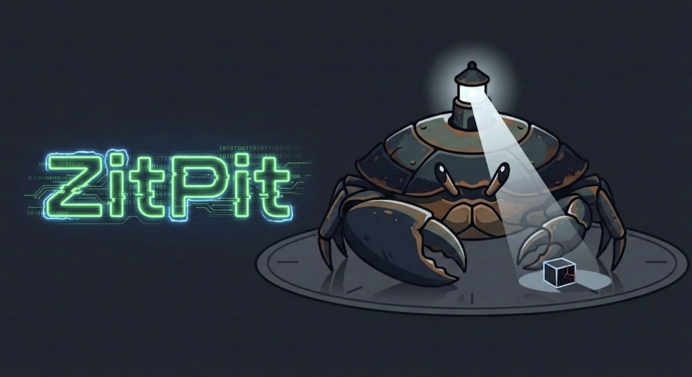
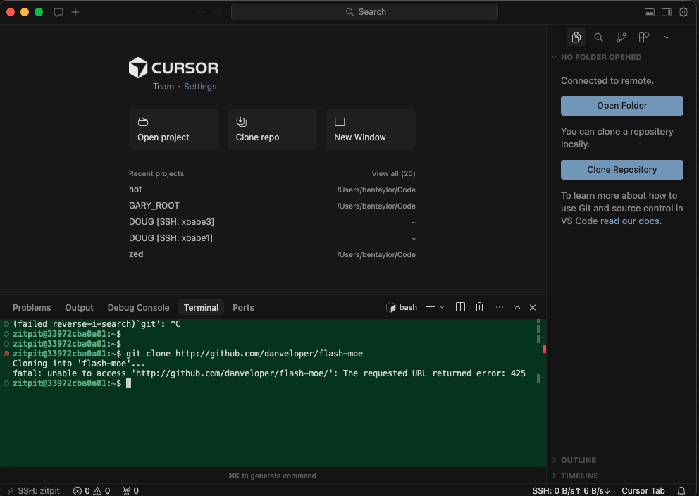
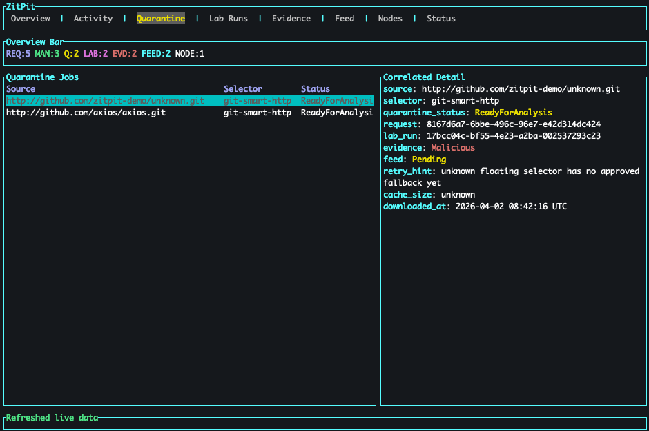
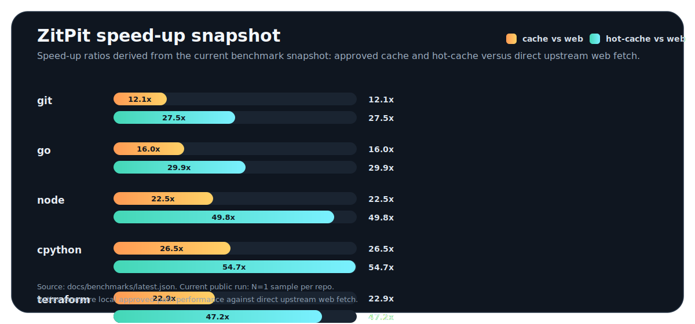
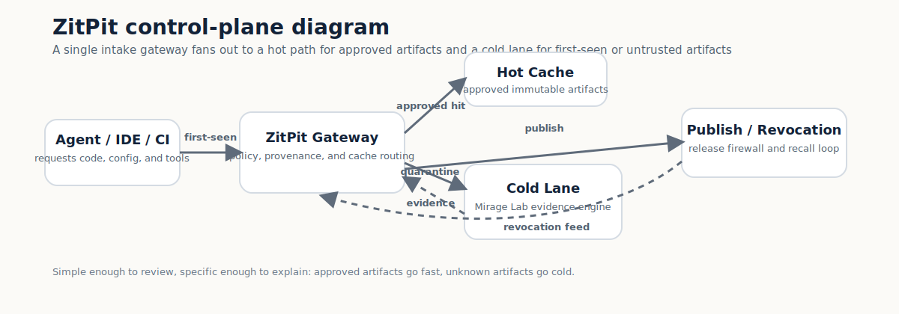

ZitPit is a **Mandatory Artifact Firewall and Governed Execution Plane** for AI-assisted development.

In the age of autonomous agents, "first-seen" external code must transition from an *execution event* into a *policy event*. ZitPit prevents unapproved third-party artifacts from executing on protected developer machines or CI runners before digest resolution, policy evaluation, and quarantine.

Current public evidence shows why the safe path needs to be fast: the five-repo benchmark snapshot in [`docs/benchmarks/latest.md`](docs/benchmarks/latest.md) shows `web` medians of 433-1062 ms, approved cache medians of 32-44 ms, and hot-cache medians of 13-16 ms, with `N=5` samples per repo.

The latest paper bundle lives in [`paper/zitpit-v1.0-paper.pdf`](paper/zitpit-v1.0-paper.pdf), the draft paper lives in [`papers/publication-draft.md`](papers/publication-draft.md), and the public claim boundaries live in [`CLAIMS.md`](CLAIMS.md) and [`BENCHMARKS.md`](BENCHMARKS.md).

---

## 🛡️ The Paradigm Shift

When AI coding agents (Antigravity, Cursor, Claude, Codex) operate at speed, an unmediated `npm install` or `pip install` rolls the dice with your infrastructure. ZitPit decouples agentic workflows from direct open-internet execution.

**The safe path is the fast path:** approved immutable artifacts are served from a local cache while unknown artifacts are forced through governed intake and detonation.

---


## Architecture: The 4-Stage Control Plane

ZitPit protects the software intake boundary across four stages:

### 1. Acquire (The Universal Artifact Gateway)
All external dependency traffic ZitPit mediates resolves through `zitpit-gateway`. Mutable references such as tags and `latest` are treated as policy exceptions. Everything is governed by exact immutable identities whenever the ecosystem makes that possible.

### 2. Build (The Cold Lane)
Install-time and build-time scripts such as `postinstall` and `build.rs` should never run dynamically on the protected host before policy approval. They are quarantined and executed in the **Mirage Lab**, our evidence engine, until policy allows promotion.

### 3. Execute (The Agent Capsule)
Agent tool use and execution privileges are policy-controlled through execution hooks and workspace policy. Isolation starvation is the default posture: agents run in ephemeral workspaces isolated from ambient secrets.

### 4. Publish (The Release Firewall)
An optional publisher-side release gate inspects artifacts before shipment, blocking accidental internal packaging leaks such as source maps, keys, and workflow drift.

The current repository proves the Git intake path, the local cache, the hot cache, the benchmark harness, and the operator surfaces that make those decisions visible. Broader ecosystem coverage is on the roadmap, not hidden inside today's public claims.

---


## Proof Gallery

### Agent Setup

<p align="center">
  
</p>

This screenshot shows the kind of protected workspace setup ZitPit is built to guard. The agent-facing bootstrap, shell config, and repo-open surface all matter because they determine whether first-seen code can reach execution on the host.

### Operator Console

<p align="center">
  
</p>

The TUI is the operator's live view into the intake perimeter. It is where approved artifacts, pending quarantine jobs, and policy decisions become visible instead of hiding inside logs.

### Benchmark Snapshot

<p align="center">
  
</p>

The benchmark chart shows the public claim we are making today: approved cache hits and hot-cache hits are dramatically faster than direct upstream fetches, so the safe path does not have to be the slow path.

### Control Plane

<p align="center">
  
</p>

The network diagram shows the control flow at a glance: agent and CI requests enter the gateway, approved artifacts take the hot path, first-seen artifacts fall into the cold lane, and publish or revocation signals flow back into policy.

The public benchmark matrix is the claim boundary. See [`BENCHMARKS.md`](BENCHMARKS.md) for supported surfaces and [`CLAIMS.md`](CLAIMS.md) for the exact public wording.

---

## 🚀 Key Features

*   **Standards-Backed Trust Plane**: Designed to consume TUF, Sigstore, in-toto, and SLSA provenance signals rather than relying on bare file hashes.
*   **Capability-Scoped Verdicts**: Approvals are granular (`FETCH_ONLY`, `BUILD_NO_NETWORK`, `RUN_DEV`, `BLOCKED`).
*   **Anti-Evasion Evidentiary Engine**: The Mirage Lab runs unknown code across diverse personas to generate auditable behavior graphs and signed evidence packs.
*   **Agent-Native Interception**: Governs `.claude/`, `.mcp.json`, devcontainers, and tool execution bounds as supply-chain surfaces.

---


## Quickstart

> [!CAUTION]
> The quickstart demonstrates the currently implemented Git intake path and supporting operator workflow. Use [`BENCHMARKS.md`](BENCHMARKS.md) and [`CLAIMS.md`](CLAIMS.md) as the source of truth for what is proven today versus what is still on the roadmap.

### 1. Verification Bootstrap
Always verify ZitPit before running. This is a bootstrap integrity check, not the full provenance model:

```bash
sh scripts/verify_hash.sh
```

### 2. Demo Orchestration (Docker)
Run the guided demo setup:

```bash
cargo run -p xtask -- demo setup
```

Then paste the printed SSH block into `~/.ssh/config` and open the protected shell:

```bash
ssh zitpit
```

Access the TUI Admin Console:

```bash
cargo run -p zitpit-tui
```

### 3. Battle-Test Suites
Run the Rust-orchestrated exploit-pack suites:

```bash
cargo run -p xtask -- battle lint
cargo run -p xtask -- battle fast
cargo run -p xtask -- battle go
cargo run -p xtask -- battle cargo
cargo run -p xtask -- battle shell
cargo run -p xtask -- battle workspace
cargo run -p xtask -- battle public-core
```

*(Refer to [BENCHMARKS.md](BENCHMARKS.md) for the public evaluation matrix and claim boundaries.)*

---


## Roadmap & Community

ZitPit 1.0 is the beginning of the public contract, not the end of the work. The roadmap is focused on proof obligations that make the project stronger in public:

*   broaden mediated intake beyond Git into package-manager-native flows
*   harden provenance-aware policy and publisher-drift detection
*   deepen repo-open and agent-policy enforcement across IDE surfaces
*   expand reproducible benchmark families and incident replay coverage
*   improve release hygiene tooling and publisher-side gates

Read [ROADMAP.md](ROADMAP.md) for the detailed plan, [MISSION.md](MISSION.md) for the ethos, and [CONTRIBUTING.md](CONTRIBUTING.md) to get involved.

We especially want help from the community with benchmark cases, battle packs, ecosystem adapters, docs, threat-model review, and reproducible incident replays. If you want to make ZitPit world-class, that is the path.

---

## 📄 License

ZitPit is dual-licensed under **MIT** and **Apache 2.0**.
